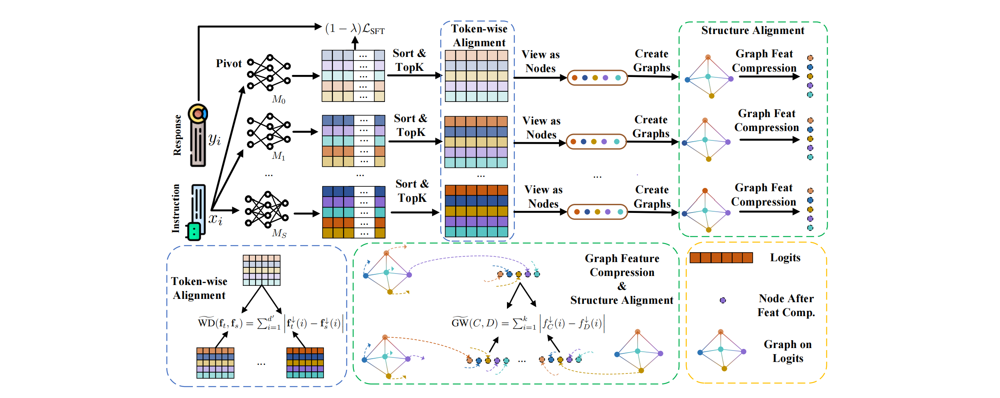

<h1 align="center">
InfiGFusion: Graph-on-Logits Distillation via Efficient Gromov-Wasserstein for Model Fusion
</h1>

<h4 align="center">

[](https://arxiv.org/pdf/2505.13893) 
[](https://arxiv.org/pdf/2505.13893)
[](https://arxiv.org/pdf/2505.13893)
  
</h4>

**InfiGFusion** is the first structure-aware fusion framework for large language models that models semantic dependencies among logits using feature-level graphs. We introduce a novel Graph-on-Logits Distillation (GLD) loss that captures cross-dimension interactions via co-activation graphs and aligns them using an efficient, provable approximation of Gromov-Wasserstein distance (reducing complexity from O(n^4) to O(nlogn)). Our released **InfiGFusion-14B** model consistently shows better performance, achieving +35.6 on Multistep Arithmetic and +37.06 on Causal Judgement over SFT, demonstrating superior multi-step and complex logic inference.

## 🎉 News
🎉 The ckpt model, InfiGFusion-14B, has been released on Huggingface! ! !

## 🎨 Fusion Framework


## 📕 Model Summary 

|                         |                                                                               |     
|-------------------------|-------------------------------------------------------------------------------|
| **Developers**          | Reallm-Labs                                                                   |
| **Description**         | InfiGFusion is an open fusion model series designed to fuse multiple domain LLMs into a single LLM. It excels in multi-step and relational inference, enabling robust performance across complex reasoning tasks.|
| **Architecture**        | 14B parameters, dense decoder-only Transformer model                          |
| **Inputs**              | Text, best suited for prompts in the chat format                              |
| **Max Context length**  | 16K tokens                                                                    |
| **Fusing input length** | 4K tokens                                                           |
| **Fusing time**         | 192 hours                                                                       |
| **Fusing data**         | 520M tokens                                                                   |
| **Outputs**             | Generated text in response to input                                           |
| **Status**              | Static model trained on an offline dataset                                    |
| **License**             | MIT                                                                         |

## 🩺 Intended Use 
|                            |                   |
| -------------------------- | ------------------|
| **Primary Use Cases**      | `InfiGFusion` is designed to accelerate research on language model fusion and serve as a foundation for generative AI-powered features. It is suitable for building general-purpose AI systems and applications (primarily in English), especially in scenarios that require:<br><br>1. Operation in memory- or compute-constrained environments.<br>2. Low-latency inference.<br>3. Advanced reasoning and logical inference.|
| **Out-of-Scope Use Cases** | `InfiGFusion` is not specifically optimized or evaluated for all downstream tasks. As such:<br><br>1. Developers should consider the general limitations of language models and carefully evaluate performance, safety, and fairness before deploying in sensitive or high-stakes applications.<br>2. Use of the model must comply with all applicable laws and regulations (e.g., data privacy, export controls), particularly given its English-language focus.<br>3. This Model Card does not alter or restrict the terms of the model’s open-source license. |

## 💼 Data Overview 

### 📚 Training Data

We construct a novel multi-task training dataset comprising **130k curated examples** across three major domains: **general reasoning**, **mathematics**, and **code generation**.

1. **General Reasoning (52K samples)**
   Samples are sourced from the [Infinity-Instruct](https://huggingface.co/datasets/BAAI/Infinity-Instruct) dataset, a high-quality instruction-following corpus created through expert filtering.

2. **Mathematics (39K samples)**
   Questions are drawn from the [NuminaMath-1.5](https://huggingface.co/datasets/AI-MO/NuminaMath-1.5) dataset—an advanced benchmark for competition-level math spanning Algebra, Geometry, Combinatorics, Calculus, Inequalities, Logic & Puzzles, and Number Theory.
   Answers are distilled from the [DeepSeek-R1-671B](https://huggingface.co/datasets/a-m-team/AM-DeepSeek-R1-Distilled-1.4M) model by the AM team.

3. **Code Generation (39K samples)**
   We used [KodCode-V1-SFT-R1](https://huggingface.co/mlfoundations-dev/KodCode-V1-SFT-R1_300k_batch_size_512), a dataset with 268K code samples. Each example was processed by our pivot model to generate five completions. These were sandbox-evaluated, and samples where at least one generation failed were flagged. From these, we filtered and distilled 39K high-quality examples.


| **Type**          | **General**       | **Math**       | **Code**          |
| ----------------- | ----------------- | -------------- | ----------------- |
| **Dataset**       | Infinity-Instruct | NuminaMath-1.5 | KodCode-V1-SFT-R1 |
| **Original Size** | 1.4M              | 1.4M           | 268K              |
| **Filtered Size** | 52K               | 39K            | 39K               |

#### Benchmark evaluation 

To enhance the robustness of answer extraction under the regex-based evaluation framework of[OpenCompass](https://github.com/open-compass/opencompass) and [EvalPlus](https://github.com/evalplus/evalplus), we systematically refine the prompts used in several benchmark datasets. These tailored prompt formats are designed to facilitate precise output matching, mitigating ambiguities that often arise from model generations. The revised prompt templates corresponding to each dataset are presented in the following Table, which details how task instructions and answer formats are standardized to align with OpenCompass's automatic evaluation pipeline.

For datasets such as TheoremQA and HumanEval, we retain the original prompt configurations, adhering to their respective community-adopted evaluation protocols. This ensures consistency with prior works and preserves the validity of established benchmarks.
For MBPP, we utilize EvalPlus for a more rigorous assessment of LLM-generated code, providing enhanced reliability in functional correctness evaluation, more specifically: 

| **Benchmark**   | **Prompt Format**  |
| ------------- | ----------------------------------|
| **IFEval**    | `{prompt}\nPlease directly give the correct answer:`  |
| **ARC-C**     | `Question: {question}\nA. {textA}\nB. {textB}\nC. {textC}\nD. {textD}\nDirectly give me the correct answer option, and then explain:`  |
| **Hellaswag** | `{ctx}\nQuestion: Which ending makes the most sense?\nDirectly give me the correct choice, you can further explain it or not.\nA. {A}\nB. {B}\nC. {C}\nD. {D}\nYou may choose from 'A', 'B', 'C', 'D'.\nAnswer:`                                                        |
| **BBH**       | `Follow the given examples and answer the question.\n{_hint}\nQ: {input}\nA: Let's think step by step.` |
| **DROP**      | `You will be asked to read a passage and answer a question. Some examples of passages and Q&A are provided below.\n{drop_examples}\n\n# Your Task\n---\n{prompt}\nThink step by step, then write a line of the form "Answer: $ANSWER" at the end of your response.`   |
| **MMLU**      | `{_hint}\nQuestion: {input}\nA. {A}\nB. {B}\nC. {C}\nD. {D}\n\nFor simple problems:\nDirectly provide the answer with minimal explanation.\n\nFor complex problems:\nUse this step-by-step format:\n## Step 1: [Concise description]\n[Brief explanation]\n## Step 2: [Concise description]\n[Brief explanation]\n\nRegardless of the approach, always conclude with:\nThe answer is [the_answer_letter].\nwhere the [the_answer_letter] is one of A, B, C or D.\n\nLet's think step by step.` |
| **GSM8K**     | `{question}\nPlease reason step by step, and put your final answer within \boxed{}.` |
| **MATH**      | `{problem}\nPlease reason step by step, and put your final answer within \boxed{}.` |


## 🚀 Usage

### Input Formats

Our fusion process uses [phi-4](https://huggingface.co/microsoft/phi-4) as the **pivot model**, and thus **InfiGFusion shares the same prompt format and usage style** as `phi-4`.

Given the nature of the training data, `InfiGFusion` performs best when used with prompts in the following chat-style format:

```bash
<|im_start|>system<|im_sep|>
You are a medieval knight and must provide explanations to modern people.<|im_end|>
<|im_start|>user<|im_sep|>
How should I explain the Internet?<|im_end|>
<|im_start|>assistant<|im_sep|>
```

### With `transformers`

```python
import transformers

pipeline = transformers.pipeline(
    "text-generation",
    model="InfiGFusion",  # replace with actual model path
    model_kwargs={"torch_dtype": "auto"},
    device_map="auto",
)

messages = [
    {"role": "system", "content": "You are a medieval knight and must provide explanations to modern people."},
    {"role": "user", "content": "How should I explain the Internet?"},
]

outputs = pipeline(messages, max_new_tokens=1024)
print(outputs[0]["generated_text"][-1])
```

> 📌 *Note: Since InfiGFusion uses `phi-4` as its pivot model during fusion, it inherits many of its usage patterns and prompt compatibility features.*


## 🎯 Model Quality


## ✅ Responsible AI Considerations

Like other large language models, `InfiGFusion` may exhibit behaviors that raise concerns around fairness, safety, and reliability. While our fusion framework enhances reasoning and relational inference, the foundation models it integrates—including the pivot model `phi-4`—carry inherited limitations. Users should be aware of the following considerations:

* **Language Coverage & Bias:**
  InfiGFusion is primarily trained and evaluated on English datasets. Its performance on non-English inputs may be degraded. Moreover, any biases or stereotypes present in the underlying models or datasets may be preserved or amplified through the fusion process.

* **Representation of Harms & Perpetuation of Stereotypes:**
  The fused models may over- or under-represent certain groups or reinforce societal stereotypes. Although quality filters and alignment procedures are used, they cannot fully eliminate harmful representations due to real-world imbalances in the data sources.

* **Content Safety:**
  The model may generate inappropriate, offensive, or unsafe content, especially in unconstrained or adversarial inputs. It is not recommended for use in sensitive domains (e.g., mental health, legal advice) without additional safeguards.

* **Fused Behavior Complexity:**
  Due to the fusion of multiple distinct models, `InfiGFusion` may exhibit complex or emergent behaviors not present in any single model. This makes interpretability and debugging more challenging, especially in high-risk applications.

* **Factuality & Hallucination:**
  Like other generative models, `InfiGFusion` may produce convincing yet factually incorrect or outdated content. Developers should not rely on model output as a source of truth and are encouraged to integrate verification mechanisms such as Retrieval-Augmented Generation (RAG).

* **Code Generation Limitations:**
  While `InfiGFusion` includes training on code-related datasets, it may still produce invalid, unsafe, or incomplete code snippets. Outputs involving unfamiliar libraries or languages should be carefully reviewed before use.

---

### Developer Responsibilities

Developers using `InfiGFusion` are encouraged to:

* **Evaluate outputs contextually**, particularly for fairness, accuracy, and safety.
* **Follow all applicable laws and regulations**, including those relating to privacy, trade compliance, and data use.
* **Avoid deployment in high-stakes decision-making** (e.g., employment, finance, law enforcement) without extensive validation and domain-specific safeguards.
* **Implement content filtering and feedback mechanisms**, and consider integrating external safety services such as [Azure AI Content Safety](https://azure.microsoft.com/en-us/products/ai-services/ai-content-safety) or custom classifiers.
* **Clearly disclose to users** that they are interacting with an AI system, following transparency and responsible AI best practices.

By using this model, you agree to evaluate and manage risks responsibly and ensure your applications align with ethical and regulatory expectations.


## 🗒️ BibTex Citation

If you find this work helpful, feel free to give us a cite.

```bigquery
@article{wang2025infigfusion,
  title={InfiGFusion: Graph-on-Logits Distillation via Efficient Gromov-Wasserstein for Model Fusion},
  author={Wang, Yuanyi and Yan, Zhaoyi and Zhang, Yiming and Zhou, Qi and Gu, Yanggan and Wu, Fei and Yang, Hongxia},
  journal={arXiv preprint arXiv:2505.13893},
  year={2025}
}
```
